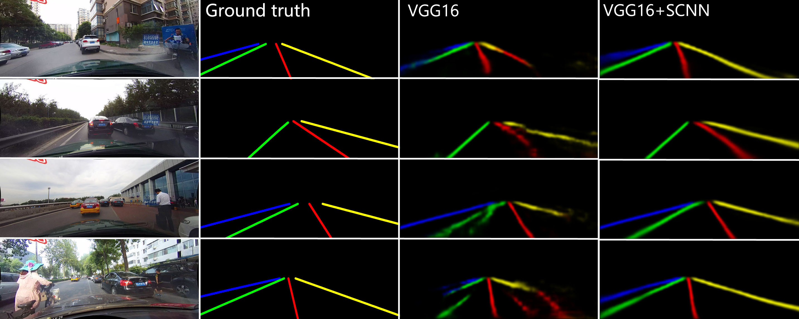

## Spatial CNN for Traffic Lane Detection

### Paper

Xingang Pan, Jianping Shi, Ping Luo, Xiaogang Wang, Xiaoou Tang. ["Spatial As Deep: Spatial CNN for Traffic Scene Understanding"](https://arxiv.org/abs/1712.06080), AAAI2018

This code is modified from [fb.resnet.torch](https://github.com/facebook/fb.resnet.torch).

### Introduction
   

- Spatial CNN enables explicit and effective spatial information propagation between neurons in the same layer of a CNN.  
- It is extremly effective in cases where objects have strong shape priors like the long thin continuous property of lane lines.  
VGG16+SCNN outperforms ResNet101 on lane detection.

### Requirements
- [Torch](http://torch.ch/docs/getting-started.html), please follow the installation instructions at [fb.resnet.torch](https://github.com/facebook/fb.resnet.torch).
- Matlab (for tools/prob2lines), version R2014a or later.
- Opencv (for tools/lane_evaluation), version 2.4.8 (later 2.4.x should also work).
- Hardware: 
For testing, GPU with 3G memory suffices.
For training, we recommend 4xGPU with 12G memory.

### Before Start
1. Clone the SCNN repository
    ```Shell
    git clone https://github.com/XingangPan/SCNN.git
    ```
    We'll call the directory that you cloned SCNN as `$SCNN_ROOT`

2. Download CULane dataset
    ```Shell
    mkdir -p data/CULane
    cd data/CULane
    ```
   Download [CULane](https://xingangpan.github.io/projects/CULane.html) dataset and extract here. (Note: If you have downloaded the dataset before 16th April 2018, please update the raw annotations of train&val set as described in the dataset website.)   
   You should have structure like this:
    ```Shell
    $SCNN_ROOT/data/CULane/driver_xx_xxframe    # data folders x6
    $SCNN_ROOT/data/CULane/laneseg_label_w16    # lane segmentation labels
    $SCNN_ROOT/data/CULane/list                 # data lists
    ```
### Testing
1. Download our pre-trained models to `./experiments/pretrained`
    ```Shell
    cd $SCNN_ROOT/experiments/pretrained
    ```
   Download [our best performed model](https://drive.google.com/open?id=1Wv3r3dCYNBwJdKl_WPEfrEOt-XGaROKu) here.

2. Run test script
    ```Shell
    cd $SCNN_ROOT
    sh ./experiments/test.sh
    ```
    Testing results (probability map of lane markings) are saved in `experiments/predicts/` by default.

3. Get curve line from probability map
    ```Shell
    cd tools/prob2lines
    matlab -nodisplay -r "main;exit"  # or you may simply run main.m from matlab interface
    ```
    The generated line coordinates would be saved in `tools/prob2lines/output/` by default.

4. Calculate precision, recall, and F-measure
    ```Shell
    cd $SCNN_ROOT/tools/lane_evaluation
    make
    sh Run.sh   # it may take over 30min to evaluate
    ```
    Note: `Run.sh` evaluate each scenario separately while `run.sh` evaluate the whole. You may use `calTotal.m` to calculate overall performance from all senarios.  
    By now, you should be able to reproduce our result in the paper.
    
### Training
1. Download VGG16 pretrained on ImageNet
    ```Shell
    cd $SCNN_ROOT/experiments/models
    ```
   Download VGG16 model [here](https://drive.google.com/open?id=12RLXY6o8gaGMY1K1g6d447Iby9ewVIyV) and move it to `$SCNN_ROOT/experiments/models/vgg`.
2. Generate SCNN model
    ```Shell
    th SCNN-gen.lua
    ```
    The generated model will be saved in `./vgg_SCNN_DULR9_w9` by default.
3. Training SCNN
    ```Shell
    cd $SCNN_ROOT
    sh ./experiments/train.sh
    ```
    The training process should start and trained models would be saved in `$SCNN_ROOT/experiments/models/vgg_SCNN_DULR_w9` by default.  
    Then you can test the trained model following the Testing steps above. If your model position or name is changed, remember to set them to yours accordingly.

### Tensorflow Implementation
This project is based on lua torch. For tensorflow implementation, please refer to https://github.com/cardwing/Codes-for-Lane-Detection.

### Citing SCNN or CULane
```  
@inproceedings{pan2018SCNN,  
  author = {Xingang Pan, Jianping Shi, Ping Luo, Xiaogang Wang, and Xiaoou Tang},  
  title = {Spatial As Deep: Spatial CNN for Traffic Scene Understanding},  
  booktitle = {AAAI Conference on Artificial Intelligence (AAAI)},  
  month = {February},  
  year = {2018}  
}
```  
### Acknowledgment
Most work for building CULane dataset is done by [Xiaohang Zhan](https://xiaohangzhan.github.io/), Jun Li, and Xudong Cao. We thank them for their helpful contribution.
